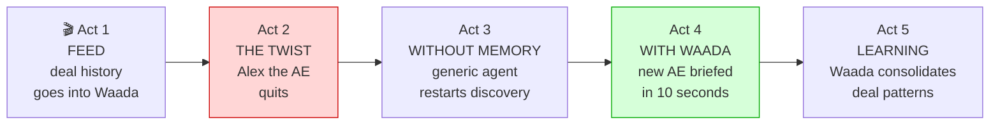
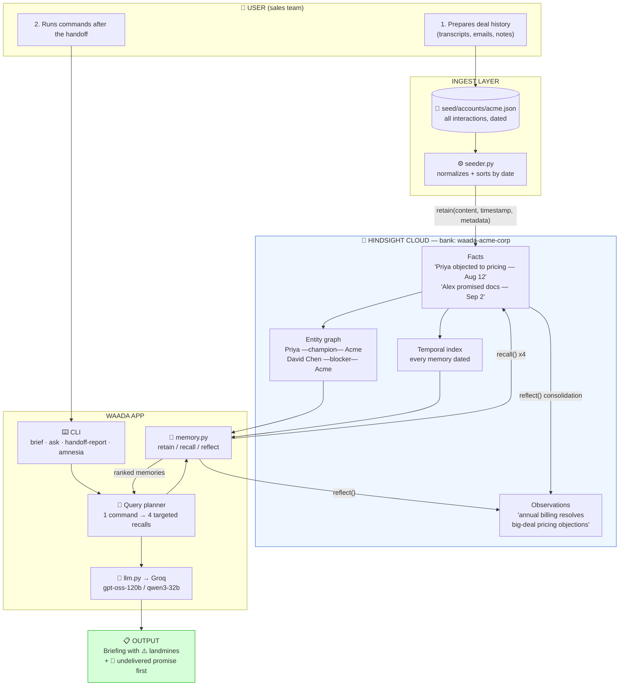
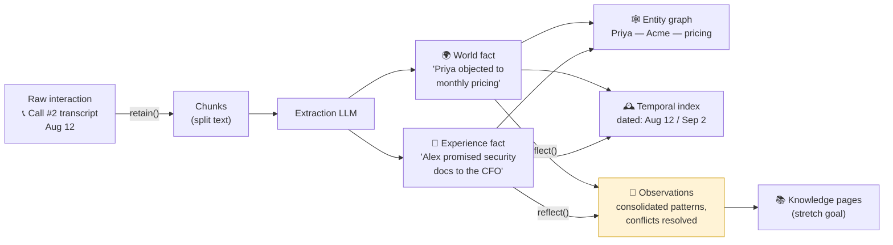

# Waada — Complete Workflow (User's-Eye View)

> **The name:** *Waada* (वादा) is Hindi for **promise** — and promise-tracking is the product's signature moment: the agent surfaces the promise the departed rep never kept.
>
> Read this first. It walks through **what happens, step by step, when you use Waada** — then explains every component in detail.
>
> 💡 *Mermaid tip: in VS Code install the "Markdown Preview Mermaid Support" extension (or view on GitHub) to see the diagrams rendered.*

---

## 0. The story in 5 acts



Everything below serves Act 4 — the moment the new AE gets a briefing containing things **no CRM field knows**: the resolved objection, the undelivered promise, the champion's own words.

---

## 1. The complete system — one picture



Two big flows to notice:
- **Write path (top):** interactions in → memory built (Act 1)
- **Read path (bottom):** command in → briefing out (Act 4)

---

## 2. Your journey, step by step

### Step 0 — One-time setup (≈20 min)
| You do | What happens |
|---|---|
| Register at Hindsight Cloud, apply promo `MEMHACK99` | You get a hosted memory server + API key |
| Get a Groq API key | Your "brain" for synthesis |
| Fill `.env` (4 variables) | Waada now knows where memory lives and which LLM to use |
| Run the smoke test | `retain` one fact → `recall` it back → ✅ chain works |

### Step 1 — FEED: give the deal its memory (Act 1)
```bash
python -m seed.seeder --account acme
```
What actually happens, per interaction:
1. Seeder reads `acme.json` → sorts interactions **chronologically**
2. For each: calls `retain(bank="waada-acme-corp", content=…, timestamp=…, metadata=…)`
3. Inside Hindsight: text is chunked → an extraction LLM pulls **facts** ("Priya objected to monthly pricing") → facts get **dated** and linked into the **entity graph**
4. You can literally watch the bank fill up in the Hindsight web UI

> 🔑 Design decision: `timestamp` is the real date of the interaction, not "now". That's what makes *"what changed since July?"* answerable later.

### Step 2 — THE TWIST (Act 2)
Alex quits. The company keeps: a CRM record with stage + amount + "follow up next week". It loses: everything else. *No code runs here — this is real life intervening. 😄*

### Step 3 — WITHOUT MEMORY: the baseline (Act 3)
```bash
python -m waada.cli amnesia acme
```
The same LLM gets **only CRM fields**. It produces a generic intro that restarts discovery — and typically re-raises the pricing objection that was already resolved. This output exists only to make the next step shine.

### Step 4 — WITH WAADA: the briefing (Act 4) ⭐
```bash
python -m waada.cli brief acme
```
Full sequence in the diagram below (§3). The output contains:
- 📖 Deal story in 3 sentences
- 👥 Champion (Priya) + blocker (CFO) + what each cares about
- ⚠️ **Landmine:** *"Do NOT re-open pricing — resolved Aug 12 via annual billing"*
- 🚩 **Undelivered promise (surfaced first):** *"Security docs were promised to the CFO on Sep 2 — still not sent. Do this before the call."*
- 💬 The prospect's own words to lead with

Follow-ups the new AE can run:
```bash
python -m waada.cli ask acme "What did Priya say about pricing?"
python -m waada.cli ask acme "What changed since July?"     # ← temporal recall
python -m waada.cli handoff-report acme                     # full doc + learned patterns
```

### Step 5 — LEARNING (Act 5)
`reflect()` consolidates repeated experiences into observations: *"Pricing objections on deals >$50K resolve with annual billing"* — shown in the handoff report as **learned patterns**. Memory that gets smarter, not just bigger.

---

## 3. Under the hood: what `brief acme` does (sequence)

```mermaid
sequenceDiagram
    actor AE as 👤 New AE
    participant CLI as ⌨️ waada CLI
    participant AG as 🧭 Query planner<br/>(agent.py)
    participant MW as 🔌 memory.py
    participant HS as 🧠 Hindsight bank<br/>waada-acme-corp
    participant LLM as 🤖 Groq

    AE->>CLI: waada brief acme
    CLI->>AG: build briefing for account "acme"

    AG->>MW: search("promises we made, delivered or not")
    MW->>HS: recall(query, budget=high)
    HS-->>MW: "Alex promised security docs to CFO — Sep 2 — NOT delivered"
    MW-->>AG: memory + source citation

    AG->>MW: search("objections and how they were resolved")
    MW->>HS: recall(query)
    HS-->>MW: "Pricing objection Aug 12 → resolved with annual billing + 8% discount"

    AG->>MW: search("stakeholders, roles, sentiment")
    MW->>HS: recall(query)
    HS-->>MW: "Priya Nair = champion (Q4 go-live); David Chen CFO = blocker (security docs)"

    AG->>MW: search("what changed recently")
    MW->>HS: recall(query)
    HS-->>MW: "Timeline moved Q3 → Q4 (Sep 18 call)"

    AG->>LLM: recalled memories + briefing system prompt
    LLM-->>AG: synthesized briefing
    AG-->>CLI: formatted output
    CLI-->>AE: 📋 Briefing — landmine warning + undelivered promise first
```

**Why 4 small recalls instead of 1 big one?** One giant query ("everything about Acme") dilutes ranking; targeted queries guarantee each demo element (promises, objections, stakeholders, changes) is *fetched on purpose* — so the briefing never misses the landmine.

---

## 4. Inside Hindsight: how a memory is born



- **World facts** = things the prospect said/are true about the deal
- **Experience facts** = things *we* did or promised → this is how undelivered promises are findable later
- **Temporal index** = answers "since July / last month / what changed"
- **Observations** = consolidated beliefs that update with new evidence (champion changes jobs → memory supersedes, keeps history)

---

## 5. Every component, in detail

| # | Component | File(s) | Job | Input → Output |
|---|---|---|---|---|
| 1 | **Account data** | `seed/accounts/*.json` | The fuel: dated interactions with participants | You write it (per DATA_PLAN.md) → structured JSON |
| 2 | **Seeder** | `seed/seeder.py` | Normalizes + chronologically `retain()`s everything | JSON → filled memory bank |
| 3 | **Config** | `waada/config.py`, `.env` | Loads keys, model name; builds bank IDs (`waada-<account>`) | `.env` → validated settings |
| 4 | **Memory wrapper** | `waada/memory.py` | The ONLY module that talks to Hindsight: `ensure_bank`, `remember`, `search`, `answer` | plain queries → memories + citations |
| 5 | **Hindsight Cloud** | (hosted) | The actual memory: facts, graph, temporal index, observations | retained content → recallable knowledge |
| 6 | **Query planner** | `waada/agent.py` | Expands each command into targeted recall queries | `brief acme` → 4 queries |
| 7 | **Prompts** | `waada/prompts.py` | System prompts per command (brief/ask/report) | role + rules → LLM behavior |
| 8 | **LLM layer** | `waada/llm.py` | Groq calls with retry on function-calling errors + graceful fallback | prompt + context → text |
| 9 | **CLI** | `waada/cli.py` | The user's only surface: 4 commands | your command → formatted answer |
| 10 | **Amnesia baseline** | `amnesia` command | Same LLM fed only CRM fields → the "before" | CRM JSON → naive output |

**Dependency rule that keeps it simple:** everything talks to Hindsight through `memory.py` only; everything talks to Groq through `llm.py` only. Swap providers = change one file.

---

## 6. Mental model to keep

```
CRM        remembers FIELDS      (stage, amount)          → survives the rep, but is shallow
Note-takers remember RECORDINGS  (tied to the rep's login) → deep, but dies at the exit door
Waada      remembers the DEAL    (attributed, dated,       → deep AND survives the rep
                                  consolidated memory)
```

That's the whole product. Every file in the repo exists to make that last line true.
